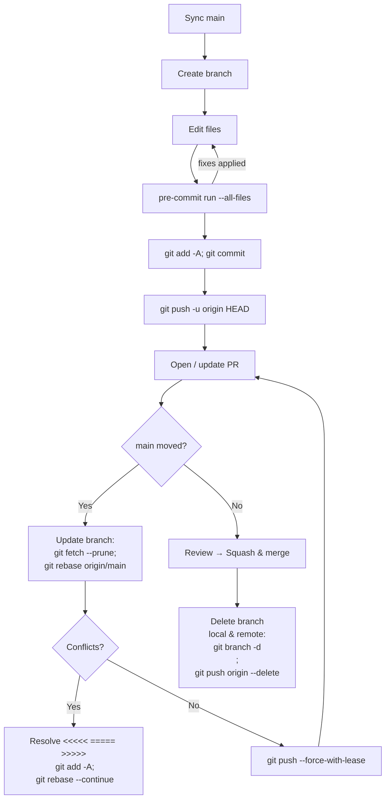

# Git Runbook — GraphFlix (CS224W)

> **Goal:** a simple, repeatable workflow that keeps `main` clean, makes feature branches easy, and prevents “I lost my work” moments.

## Table of Contents

1. [One‑time setup](#one-time-setup)
2. [Daily workflow (feature/docs/bugfix)](#daily-workflow-featuredocsbugfix)
3. [Creating & updating a Pull Request (PR)](#creating--updating-a-pull-request-pr)
4. [Keeping your branch up to date (rebase)](#keeping-your-branch-up-to-date-rebase)
5. [Handling conflicts](#handling-conflicts)
6. [“Diverged” branches & safe force‑push](#diverged-branches--safe-force-push)
7. [Pre‑commit (black/isort/flake8): what & why](#pre-commit-blackisortflake8-what--why)
8. [Recover from mistakes (lost file, bad commit, etc.)](#recover-from-mistakes-lost-file-bad-commit-etc)
9. [Large files & data](#large-files--data)
10. [Branch naming & commit messages](#branch-naming--commit-messages)
11. [Flowchart (Mermaid)](#flowchart-mermaid)

---

## One‑time setup

**Why:** configure identity, lint/format on save, and avoid GitHub email privacy errors.

```bash
# 1) Identify yourself for commits (use your GitHub noreply email to avoid GH007)
git config --global user.name  "Your Name"
git config --global user.email "<github-username>@users.noreply.github.com"

# 2) Make sure you're in the repo root
cd ~/cs224w/CS224W_GraphML_Project_ARC

# 3) Use a project venv and install dev tools (recommended)
python -m pip install --upgrade pip
pip install pre-commit black isort flake8

# 4) Install the repo’s pre-commit hooks
pre-commit install         # enables hooks on each commit
pre-commit run --all-files # run once to normalize the repo
```

> **Why noreply?** If GitHub privacy is on, pushes with a private email are rejected (GH007). Using your `…@users.noreply.github.com` avoids this.

---

## Daily workflow (feature/docs/bugfix)

**Why:** small branches → clean PRs → less conflict.

```bash
# 0) Start from a clean, up-to-date main
git fetch --prune
git switch main
git pull --ff-only

# 1) Create a focused branch
git switch -c baseline/lightgcn-neg5-cosine    # examples:
#   feature/<thing>   e.g., feature/graph-builder
#   baseline/<thing>  e.g., baseline/lightgcn
#   docs/<thing>      e.g., docs/getting-started
#   fix/<thing>       e.g., fix/metrics-typo

# 2) Make your edits...
#    (code, docs, scripts, etc.)

# 3) Check what changed and stage
git status
git add -A  # or add specific files

# 4) Run hooks locally before committing (fast feedback)
pre-commit run --all-files

# 5) Commit with a clear message (imperative, present tense)
git commit -m "baseline: LightGCN multi-negatives + cosine eval; save best checkpoint"

# 6) Push to GitHub and create/refresh the PR
git push -u origin HEAD
```

---

## Creating & updating a Pull Request (PR)

**Why:** code review + CI + documentation trail.

1. Open GitHub → **Compare & pull request** (from your branch → `main`).
2. **Title**: short, descriptive.
3. **Body**: *What / Why / How to test* + checklist (pre‑commit ran, no secrets, etc.).
4. Add reviewers (teammates).
5. While PR is open, keep pushing commits to the same branch; PR updates automatically.
6. After approval: **Squash & merge** (preferred for small, focused PRs).
7. Clean up local & remote branch:

   ```bash
   git switch main
   git pull --ff-only
   git branch -d baseline/lightgcn-neg5-cosine
   git push origin --delete baseline/lightgcn-neg5-cosine
   ```

---

## Keeping your branch up to date (rebase)

**Why:** reduce merge conflicts and keep a linear history.

```bash
# From your feature branch:
git fetch --prune
git rebase origin/main

# If conflicts:
#   - resolve (see section below), then
git add -A
git rebase --continue

# After a successful rebase, your branch history changed → update remote safely:
git push --force-with-lease
```

> **Why `--force-with-lease`?** It updates your remote branch to the rebased history **only if** the remote hasn’t moved unexpectedly—safer than `--force`.

---

## Handling conflicts

**Signs:** `CONFLICT` in terminal, or conflict markers in files.

Conflict markers look like:

```text
<<<<<<< current-branch
your changes
=======
incoming changes (from main or the other branch)
>>>>>>> target-branch
```

**Decide:**

* **Accept current** = keep your branch’s chunk.
* **Accept incoming** = take the other branch’s chunk.
* **Accept both** = keep both (often correct if they touch different logic).
* Edit by hand as needed, then:

```bash
git add <conflicted-files>
git rebase --continue    # if you were rebasing
# or
git commit               # if you were merging
```

**Pro tip:** See *which files* are conflicted:

```bash
git status
git diff --name-only --diff-filter=U
```

---

## “Diverged” branches & safe force‑push

**Symptom:**

```
Your branch and 'origin/X' have diverged,
and have N and M different commits each, respectively.
```

**Why it happens:** rebasing rewrites commit IDs, so your local history no longer matches the remote.

**Inspect before pushing:**

```bash
git fetch --prune

# Commits only on your local branch:
git log --oneline --left-right origin/X...X | grep '^>'

# Commits only on remote branch (you might overwrite these):
git log --oneline --left-right origin/X...X | grep '^<'
```

* If remote‑only commits are just the *old, pre‑rebase* versions → **safe to push**:

  ```bash
  git push --force-with-lease origin X
  ```
* If remote‑only commits include teammate changes you need → rebase *your* commits on top of the remote branch:

  ```bash
  git rebase origin/X
  # resolve conflicts if any, then
  git push --force-with-lease
  ```

---

## Pre‑commit (black/isort/flake8): what & why

* **black**: auto‑formats Python → consistent style.
* **isort**: sorts imports → consistent order.
* **flake8**: lints Python (e.g., long lines, unused imports).

**Why run it?** Prevents style/quality failures in PRs.
**How:**

```bash
# One time
pre-commit install

# Before commit or when CI complains
pre-commit run --all-files

# If hooks rewrite files:
git add -A
pre-commit run --all-files
git commit -m "chore: format/lint"
```

> If `pre-commit` isn’t found, install in your venv: `pip install pre-commit`.

---

## Recover from mistakes (lost file, bad commit, etc.)

**File accidentally edited or deleted (but not committed yet):**

```bash
git restore path/to/file
```

**Undo staged changes:**

```bash
git restore --staged path/to/file
```

**Find a file in history & restore:**

```bash
git log -- path/to/file
git checkout <sha> -- path/to/file
```

**Find “where I was” after a bad reset/rebase (lifesaver):**

```bash
git reflog
# pick the entry just before the mistake
git reset --hard <reflog-sha>
```

**Revert a specific commit (creates a new commit that undoes it):**

```bash
git revert <sha>
```

*Avoid* `git reset --hard` unless you’re sure— it discards uncommitted work.

---

## Large files & data

* Keep **data artifacts** (e.g., `data/processed/ml1m/*`, `results/*`, `.zip`) **out of Git**; share via OneDrive or similar.
* Use `.gitignore` to exclude heavy or generated files.
* If you *must* share a derived artifact (e.g., configs), commit the **smallest** text version, not binaries.

---

## Branch naming & commit messages

**Branch naming** (consistent + descriptive):

* `feature/<thing>`: new capabilities.
* `baseline/<thing>`: baselines (e.g., `baseline/lightgcn`).
* `docs/<thing>`: documentation.
* `fix/<thing>`: bug fixes.
* `tools/<thing>`: scripts/tooling.

**Commit messages** (imperative, small scope):

* `baseline: add Most-Popular recommender with Recall/NDCG@10/20`
* `docs: add GETTING_STARTED; link from README; deprecate ONBOARDING`
* `fix: mask train items during eval ranking`

---

## Flowchart (Mermaid)



---

### FAQ / Common “gotchas”

* **“Can’t automatically merge” on GitHub PR:**
  Rebase your branch on `origin/main`, resolve conflicts, then `git push --force-with-lease`.

* **“Your branch and ‘origin/X’ have diverged” locally:**
  Inspect differences (remote‑only vs local‑only), then do a safe force‑push *if* remote‑only commits are obsolete.

* **Pre‑commit errors keep changing files:**
  That’s expected—add the modified files and run again until hooks pass.

* **GH007 (private email) rejects pushes:**
  Set your `user.email` to GitHub’s noreply, amend the author, and push again (see One‑time setup).

* **Accidentally worked on `main`:**
  Create a branch *from your current state* and push it:

  ```bash
  git switch -c fix/move-work-off-main
  git push -u origin HEAD
  ```

---
